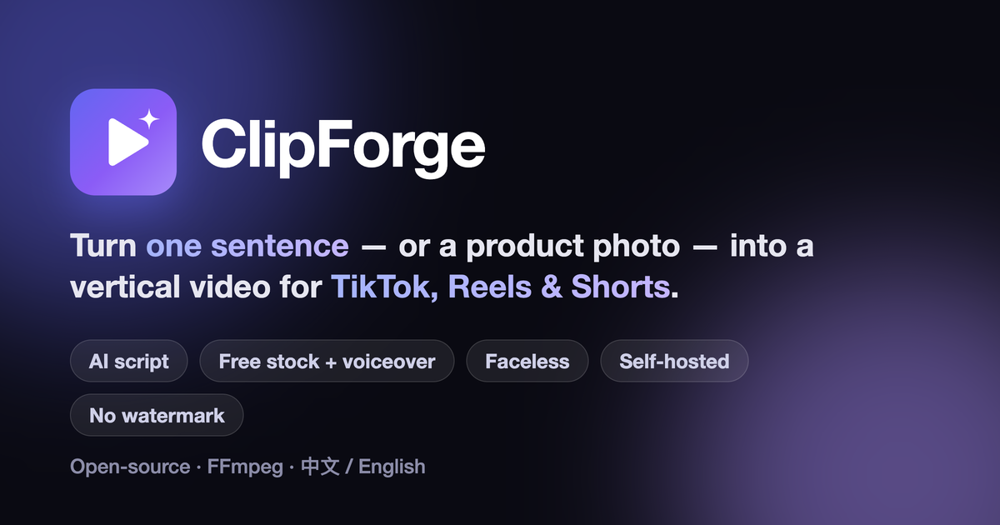

<p align="center"></p>

# ClipForge — Open-Source AI Short-Video Generator

> **Turn one sentence — or a single product photo — into a ready-to-post vertical video for TikTok, Reels & YouTube Shorts.** AI writes the script, auto-fills the footage, adds a voiceover and subtitles, and renders it in one click. Free, self-hosted, no watermark.

<p align="right"><strong>English</strong> · <a href="README.zh.md">中文</a></p>

<p align="center">
  
  
  
  
  
</p>

**ClipForge** is a free, open-source **AI video generator** you run on your own machine. It automates the whole short-form pipeline — **script → footage → voiceover → subtitles → final cut** — so anyone can make **faceless videos** and **product ads** without filming, editing, or design skills.

Two zero-friction ways to create:

- 🎬 **Text to video (faceless)** — type one topic, get a narrated vertical short. No product, **no API key required**: footage comes from free stock libraries and the voiceover from a free TTS engine. Perfect for faceless TikTok / YouTube Shorts / Instagram Reels channels.
- 🛍️ **Product & UGC video** — upload a product photo, and AI analyzes the selling points, writes the scripts, generates the shots, and composes a polished ad — ready to export for TikTok Shop, Shopify, Amazon, Etsy, Douyin, Kuaishou, or Xiaohongshu.

> Self-hosted · No watermark · Bilingual UI (中文 / English, auto-detected from your system language) · FFmpeg-powered.

---

## ✨ Features

- **One-sentence → video.** Prompt-to-video in a click — auto script, scenes, voiceover, captions. Five narration styles (explainer, story, lifestyle, motivational, travel).
- **Faceless by design.** Every shot is matched to real stock footage — no face, no camera, no on-screen talent needed.
- **Free stock footage engine.** Aggregated search across **Openverse (keyless), Pixabay, and Pexels**, with automatic attribution and an "always returns footage" fallback so no shot is ever left blank.
- **Free AI voiceover.** Built-in keyless Microsoft Edge text-to-speech — **$0, no API key**, with 5 natural voices and instant preview. Or plug in OpenAI / Atlas / MiniMax / fal.ai for premium voices.
- **AI image & video generation.** One UI over many models (Seedance 2.0, GPT-Image-2, Kling, Veo, FLUX, …) across 6 providers, with product-fidelity image-to-image so your product is never distorted.
- **Auto subtitles & motion.** Burned-in captions timed to the voiceover, Ken Burns motion, cross-fades, and price/feature overlays — all via FFmpeg.
- **Multi-platform export.** One click re-renders for TikTok / Reels / Shorts (9:16), Xiaohongshu (3:4), and more — no manual re-cropping.
- **Batch & reuse.** A product library, batch rendering, "clone a trending video" structure reuse, and auto-generated publish captions.
- **Bilingual UI.** 中文 / English, switchable anytime and auto-detected from your browser/OS language.
- **Local-first & private.** Runs on your machine with a local SQLite database; your media and keys never leave your computer.

---

## 🆚 Why ClipForge

| | Traditional workflow | Commercial SaaS | **ClipForge** |
|---|---|---|---|
| **Script** | 1–2 h writing | included | AI, ~30s for 3 scripts |
| **Footage** | shoot + edit, days | credits / per-render fees | AI **or** free stock, minutes |
| **Voiceover** | hire a VO artist | paid add-on | **free** keyless TTS |
| **Watermark** | — | often, unless you pay | **none** |
| **Your data** | — | uploaded to their cloud | **stays local** |
| **Cost** | $$$ per video | monthly subscription | **$0** in the free path |
| **Source** | — | closed | **open-source (AGPL-3.0)** |

---

## 🚀 Quick start

> Requires **[pnpm](https://pnpm.io)** (npm will not build this repo correctly) and a local **[FFmpeg](https://ffmpeg.org)** install.

```bash
pnpm install
pnpm dev          # open http://localhost:3000
```

The **text-to-video** path works with just an LLM key (stock footage + voiceover are free). For AI-generated images/video, add any one AI platform key in **Settings**.

**Desktop app (one-click, no terminal):**

```bash
pnpm dist          # builds a .dmg (macOS) / .exe (Windows) under release/
```

Pre-built installers are attached to [Releases](https://github.com/xixihhhh/clipforge/releases).

---

## ❓ FAQ

**What is ClipForge?**
A free, open-source AI short-video generator that turns a sentence or a product photo into a finished vertical video (script, footage, voiceover, subtitles) for TikTok, Reels, and YouTube Shorts.

**Is it really free?**
Yes. The text-to-video path needs **no API key** at all — footage uses free CC-licensed stock and the voiceover uses a free keyless TTS engine. You only pay if you opt into premium AI image/video models.

**Do I need to be on camera?**
No. ClipForge makes **faceless videos** — it composes stock footage and motion, so you never appear on screen.

**Can I use it for e-commerce / product ads?**
Yes. Upload a product photo and ClipForge writes the script, generates shots (keeping the product faithful), and exports platform-ready ads for TikTok Shop, Shopify, Amazon, and more.

**Is there a watermark?**
No watermark, ever. It's self-hosted and open-source.

**Which languages does the interface support?**
中文 and English, switchable anytime and auto-detected from your system language.

---

## 🛠 How it works

```
Next.js 16 (App Router) + React 19 + Tailwind 4   ·   zero-dependency i18n (zh / en)
   ├─ Script engine        prompt + templates + platform SEO + topic mode
   ├─ Stock engine         Openverse / Pixabay / Pexels aggregate search
   ├─ AI providers         6 platforms, image + video models
   ├─ TTS                  free keyless Edge TTS + paid OpenAI / Atlas / MiniMax / fal
   └─ Compositor (FFmpeg)  transitions · Ken Burns · subtitles · mixing · overlays
Drizzle ORM + better-sqlite3 (local SQLite) · Electron desktop packaging
```

See [README.zh.md](README.zh.md) for the full Chinese documentation, screenshots, and roadmap.

---

## 📄 License

**AGPL-3.0.** Free to use, modify, and self-host — but if you run a modified version as a network service, you must publish your source under the same license. See [LICENSE](LICENSE) and [NOTICE](NOTICE).

---

<sub><b>Keywords:</b> AI video generator · faceless video generator · text to video · AI short video maker · TikTok video generator · YouTube Shorts maker · Reels maker · AI UGC ads · AI voiceover · open-source / self-hosted video tool · e-commerce product video · AI script generator · stock footage automation.</sub>

<sub>ClipForge is an independent open-source project, not affiliated with TikTok, YouTube, Instagram, Shopify, Amazon, Microsoft, OpenAI, or any model provider. Use third-party models and stock sources per their terms.</sub>
